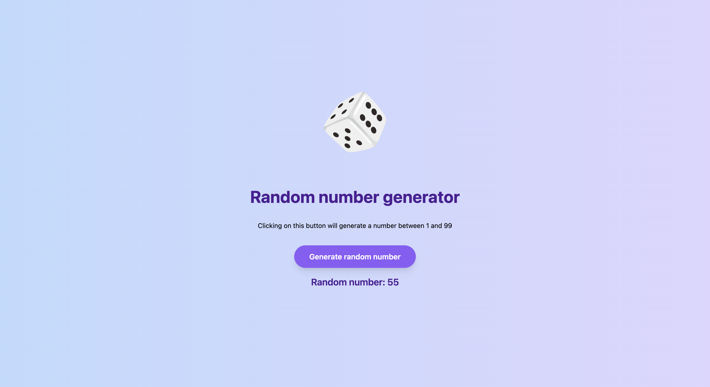

# Random number generator



This PHP application generates a random number between 1 and 99 upon clicking a button on a web page. It utilizes AJAX for communication between the frontend and backend, and cURL for secure server-side communication.


## Task description

The task involved creating a PHP web page (`index.php`) with a button that triggers a JavaScript function to make an AJAX POST request to an API endpoint (`api.php`). The API endpoint communicates securely with another PHP file (`random.php`) using cURL to generate a random number and return it as a JSON response to the JavaScript function, which then displays it on the webpage.


## Directory structure

- `index.php`: Main PHP web page with the button to generate a random number.
- `script.js`: JavaScript file containing client-side code for handling button click and AJAX request.
- `api.php`: Backend API endpoint to handle AJAX POST requests and communicate with `random.php`.
- `random.php`: PHP file to generate a random number between 1 and 99.

## Usage 

### Requirements
- PHP (5 to 8)
- A web server (e.g., Apache, Nginx)
- Tailwind CSS

### Installation

1. Clone the repo into your document root (www, htdocs, etc)
2. Ensure that PHP and a web server are properly installed and configured.
3. Ensure that cURL extension is enabled in your PHP configuration.
4. Place the project files in the root directory of your web server.


### Setting the document root

Here are some instructions for setting the document root for some popular local development tools:

#### PHP built-in server

If you are using the PHP built-in server, you can run the following command from the project root:

`php -S localhost:8000`

#### XAMPP

If you are using XAMPP, you can set the document root in the `httpd.conf` file. Here is an example:

```conf
DocumentRoot "/Applications/XAMPP/xamppfiles/htdocs/assignment"
<Directory "/Applications/XAMPP/xamppfiles/htdocs/assignment">
```

#### MAMP

If you are using MAMP, you can set the document root in the `httpd.conf` file. Here is an example:

```conf
DocumentRoot "/Applications/MAMP/htdocs/assignment"
<Directory "/Applications/MAMP/htdocs/assignment">
```

## Compatibility
The Random number generator application is compatible with PHP versions 5 through 8. To ensure compatibility with your PHP environment, you can run compatibility checks using PHP_CodeSniffer with the PHPCompatibility standard. Here's how to do it:

### Running Compatibility Checks
Ensure that PHP_CodeSniffer and PHPCompatibility are installed in your project. If not, you can install them using Composer:
```conf
composer require squizlabs/php_codesniffer phpcompatibility/php-compatibility
```

Once installed, you can run the following command to check compatibility with a specific PHP version range (5.6 to 8.0):
```conf
vendor/bin/phpcs --standard=PHPCompatibility --runtime-set testVersion 5.6-8.0 path/to/your/file.php 
```


## Dependencies

- jQuery 3.5.1: Included via a CDN link in the `<head>` section of `index.php`.

